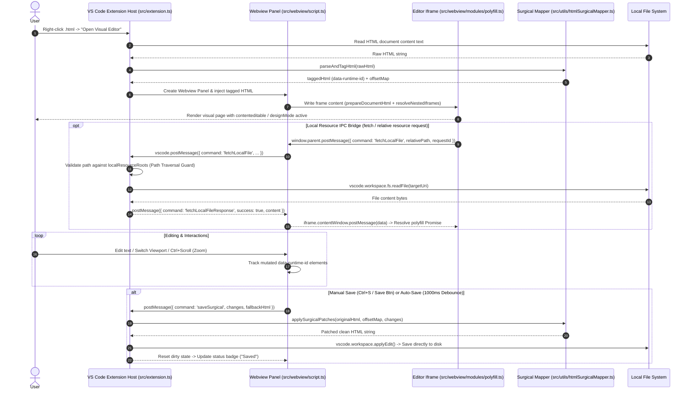

# Architecture & System Design — Visual HTML Editor

This document outlines the architecture, data flow, component breakdown, and extension integration patterns for the **Visual HTML Editor** VS Code extension.

---

## 1. System Overview & Data Flow



---

## 2. Directory Structure

```text
vscode-visual-html-editor/
├── AGENTS.md                  <-- AI & contributor workflow rules
├── ARCHITECTURE.md            <-- Architectural specification (this file)
├── LICENSE                    <-- MIT License
├── PROGRESS.md                <-- High-density milestone & progress tracking
├── README.md                  <-- Public usage documentation
├── package.json               <-- Extension manifest & bun scripts
├── biome.json                 <-- Biome linter & formatter config
├── tsconfig.json              <-- TypeScript configuration
├── .gitignore                 <-- Git exclusions
├── .vscodeignore              <-- VSIX packaging exclusions
├── src/
│   ├── extension.ts           <-- VS Code extension entry point & message bridge
│   ├── types.d.ts             <-- Ambient TypeScript declarations
│   ├── utils/
│   │   ├── debounceUtils.ts   <-- Debounce utility function with cancel support
│   │   ├── htmlSurgicalMapper.ts <-- HTML5 parse5 AST surgical offset mapper & patcher
│   │   ├── htmlTypes.ts       <-- Standalone Surgical Mapping interfaces (zero circular deps)
│   │   └── zoomUtils.ts       <-- Pure utility logic for zoom bounds & math
│   └── webview/
│       ├── codicon.css        <-- VS Code Codicon icons CSS bundle
│       ├── editorContent.ts   <-- Webview HTML content generator & asset inliner
│       ├── script.ts          <-- Main webview event coordinator & lifecycle
│       ├── style.css          <-- Webview toolbar & UI design system styles
│       ├── template.html      <-- Webview HTML DOM template structure
│       └── modules/
│           ├── commandRegistry.ts <-- Centralized command registry & dispatcher
│           ├── history.ts     <-- Undo & redo execution module
│           ├── menu.ts        <-- Popover menus & help modal controller
│           ├── mode.ts        <-- Edit vs. Preview mode toggler
│           ├── polyfill.ts    <-- Local resource IPC polyfill for iframe fetch/XMLHttpRequest
│           ├── saveState.ts   <-- Persistence status, auto-save & surgical save runner
│           ├── state.ts       <-- Reactive application state container
│           ├── viewport.ts    <-- Frame dimensions switcher (desktop, tablet, mobile)
│           └── zoom.ts        <-- Zoom state & DOM style application
└── test/
    ├── autoSavePersistence.test.ts <-- Auto-save state persistence & postMessage tests
    ├── commandRegistry.test.ts     <-- Command registry unit tests
    ├── complexSurgicalTest.test.ts  <-- Multi-element surgical editing tests
    ├── debounceUtils.test.ts       <-- Debounce utility unit tests
    ├── editorContent.test.ts       <-- Webview content generator integration tests
    ├── formatOnSaveResync.test.ts  <-- Formatter re-sync & save mutex tests
    ├── htmlAstSurgicalMapper.test.ts <-- AST multi-line & attribute expression tests
    ├── htmlSurgicalMapper.test.ts  <-- Core surgical HTML mapper & patcher tests
    ├── productionUiSurgicalTest.test.ts <-- Multi-pass roundtrip Web UI editing tests
    ├── regression.test.ts         <-- Comprehensive regression & edge-case test suite
    └── zoomUtils.test.ts           <-- Zoom bounds & formatting unit tests
```

---

## 3. Core Components Breakdown

### 3.1 Extension Host (`src/extension.ts`)
- **Responsibilities**:
  - Registers VS Code command `visual-html-editor.open` for context menu & editor title.
  - Passes original HTML through `parseAndTagHtml()` to inject `data-runtime-id` markers and build initial character `offsetMap`.
  - Spawns and manages `vscode.WebviewPanel`.
  - Handles IPC messages (`onDidReceiveMessage`) from Webview.
  - Applies surgical patches via `applySurgicalPatches()` and writes clean changes directly to disk using `vscode.workspace.applyEdit()`.
  - Intercepts panel disposal (`panel.onDidDispose`) with unsaved changes protection prompt.
  - Enforces **Security Path Traversal Guard**: validates requested relative local resource paths against `localResourceRoots` (document folder + workspace roots) via `isPathContained(root.fsPath, targetUri.fsPath)` before serving content through `vscode.workspace.fs.readFile()`.

### 3.2 Webview Runtime & Modules (`src/webview/`)
- **Template & Assets (`editorContent.ts`, `template.html`, `style.css`, `codicon.css`)**:
  - Bundles CSS styles, VS Code Codicons, HTML structure, and JS logic into a secure Webview page string.
  - Safely escapes script tags (`\u003c`) to prevent Webview injection crashes.
- **Document Preparation & Parsing (`prepareDocumentHtml()`)**:
  - Leverages browser-native `DOMParser` (`text/html`) to parse raw document strings.
  - Injects `<base href="...">` and the inline `#vhe-fetch-polyfill` script into the document `<head>` prior to iframe `document.write()`.
  - Preserves original `<!DOCTYPE html>` declarations.
- **Nested Iframe Resolution & Editing (`resolveNestedIframes()`, `enableNestedDocEditing()`)**:
  - `resolveNestedIframes()`: Recursively locates nested `<iframe src="...">` elements, fetches relative target resources, and converts them to inline `srcdoc` attributes so sub-documents render within restricted webview sandboxes.
  - `enableNestedDocEditing()`: Attaches edit mode bindings (`contentEditable`, `designMode`, and mutation observers) to nested iframe document instances to enable inline visual editing across nested sub-trees.
- **Fetch Polyfill Module (`modules/polyfill.ts`)**:
  - Overrides `window.fetch` inside iframe contexts to intercept relative URL resource calls and route them across webview boundaries via postMessage IPC.
- **Command Registry (`modules/commandRegistry.ts`)**:
  - Centralized dispatcher mapping string command IDs (e.g. `save`, `zoom-in`, `set-viewport`) to handler functions.
  - Delegates click events from `[data-command]` DOM attributes.
- **Save & State System (`modules/saveState.ts`, `modules/state.ts`)**:
  - Tracks dirty state (`isDirty`) and auto-save toggle (`autoSaveEnabled`).
  - Preserves native Chromium `designMode` Undo memory across saves by eliminating unnecessary post-save iframe reloads.
  - Handles 1-click Reload Document command (`reload-doc` / `reloadDocument`) with unsaved changes guard to re-sync directly from disk.
  - Strips transient preview styles (`style.zoom`) prior to extracting clean fallback HTML.
- **Viewport & Zoom Controllers (`modules/viewport.ts`, `modules/zoom.ts`)**:
  - Switches frame width presets (Desktop `100%`, Tablet `768px`, Mobile `375px`).
  - Clamps zoom scale (`0.3x` to `3.0x`) and updates iframe transform styles.

### 3.3 Surgical Mapper & Types (`src/utils/htmlSurgicalMapper.ts`, `src/utils/htmlTypes.ts`)
- **Responsibilities**:
  - `htmlTypes.ts`: Standalone interface contracts (`ElementOffset`, `SurgicalMapResult`, `SurgicalChange`) with zero imports to eliminate circular dependencies.
  - `parseAndTagHtml()`: Leverages HTML5-compliant `parse5` AST parser with `sourceCodeLocationInfo: true` to assign unique `data-runtime-id="e1"` tags to opening elements and record exact character ranges (`outerStart`, `outerEnd`, `innerStart`, `innerEnd`).
  - `applySurgicalPatches()`: Sorts changes in descending order of character offset (`innerStart`) to apply targeted innerHTML updates without corrupting remaining character offsets or original formatting.

### 3.4 Local Resource IPC Bridge
- **End-to-End Flow**:
  1. **Iframe Polyfill (`src/webview/modules/polyfill.ts`)**: Intercepts relative non-HTTP/HTTPS `fetch()` calls inside the preview iframe. Generates a unique `requestId` and posts a message `{ command: 'fetchLocalFile', relativePath, requestId }` to `window.parent`.
  2. **Webview Script (`src/webview/script.ts`)**: Relays `fetchLocalFile` payload from iframe window to Extension Host using `vscode.postMessage()`.
  3. **Extension Host (`src/extension.ts`)**:
     - Evaluates path safety via **Security Path Traversal Guard** (`localResourceRoots`).
     - Reads file asynchronously using `vscode.workspace.fs.readFile(targetUri)`.
     - Returns `{ command: 'fetchLocalFileResponse', requestId, success: true, content }` to webview.
  4. **Promise Resolution**: Webview forwards response back into `iframe.contentWindow.postMessage()`. The fetch polyfill resolves the awaiting Promise with a synthetic HTTP `Response(content, { status: 200 })` object.

---

## 4. Key Design Decisions & Architectural Principles

1. **Granular Surgical Save Protocol**:
   - *Decision*: Modify only edited element ranges in original source HTML instead of re-serializing the entire DOM.
   - *Rationale*: Preserves original file formatting, DOCTYPE declarations, unparsed comments, and line indentation.

2. **HTML5 Specification-Compliant Parsing (`parse5`)**:
   - *Decision*: Adopt `parse5` for AST parsing & location mapping while maintaining pure string slicing for surgical patching.
   - *Rationale*: Guarantees 100% compliance with HTML5 specification for complex web UIs (SVGs, custom attributes, multi-line elements) while eliminating custom parser maintenance overhead.

3. **Iframe Sandboxing for Visual Editing**:
   - *Decision*: Host user HTML inside an `<iframe>` within the Webview panel.
   - *Rationale*: Prevents user-defined CSS or scripts from polluting or breaking extension toolbar UI.

4. **TypeScript + Bun Stack (`bun build`, `bun test`)**:
   - *Decision*: Use TypeScript for full type safety across extension and webview modules, paired with Bun for bundling and unit testing.
   - *Rationale*: Ultra-fast bundle execution (<10ms) and test execution (<350ms) with zero heavy external build dependencies.

5. **Decoupled Module & Command Architecture**:
   - *Decision*: Split webview logic into standalone domain modules (`mode`, `history`, `viewport`, `zoom`, `saveState`, `menu`) coordinated via `commandRegistry`.
   - *Rationale*: High maintainability, clear separation of concerns, and clean testability.

