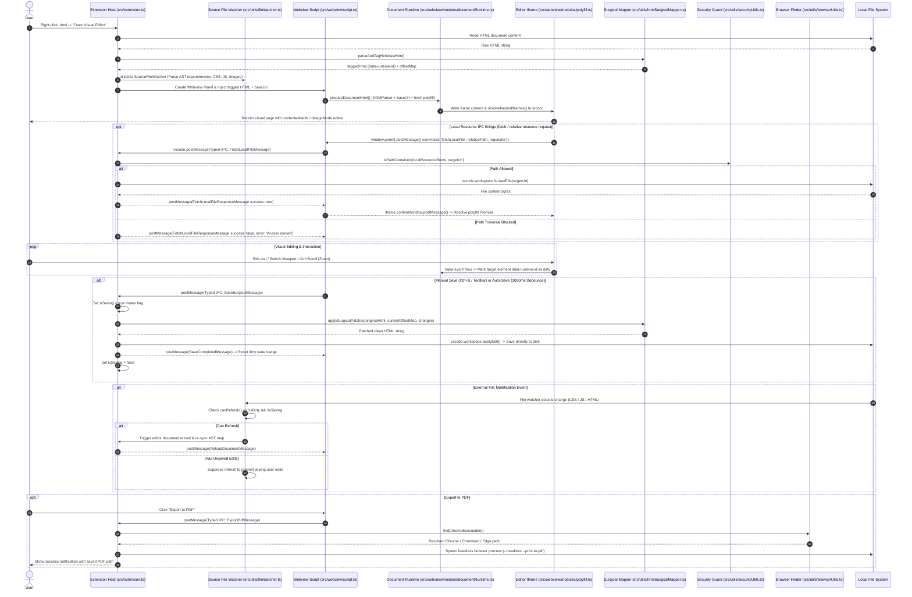

# Architecture & System Design — Visual HTML Editor

This document outlines the architecture, data flow, component breakdown, and extension integration patterns for the **Visual HTML Editor** VS Code extension.

---

## 1. System Overview & Data Flow



---

## 2. Directory Structure

```text
vscode-visual-html-editor/
├── AGENTS.md                  <-- AI & developer rules, workflows, & tech stack guidelines
├── ARCHITECTURE.md            <-- System architecture & data flow specification (this file)
├── LICENSE                    <-- MIT License
├── PROGRESS.md                <-- High-density milestone & release progress tracking
├── README.md                  <-- Public extension usage & feature documentation
├── package.json               <-- Extension manifest, activation events & bun scripts
├── biome.json                 <-- Biome linter & formatter configuration
├── tsconfig.json              <-- TypeScript compiler configuration
├── .gitignore                 <-- Git exclusions
├── .vscodeignore              <-- VSIX package deployment exclusions
├── src/
│   ├── extension.ts           <-- Extension Host entry point, IPC handler & lifecycle manager
│   ├── types.d.ts             <-- Ambient module declarations & build-time asset typings
│   ├── utils/
│   │   ├── browserUtils.ts    <-- Cross-platform Chrome/Chromium/Edge binary finder for PDF export
│   │   ├── debounceUtils.ts   <-- Pure debounce utility with immediate execution & cancel support
│   │   ├── fileWatcher.ts     <-- SourceFileWatcher & parse5 AST dependency graph mapper
│   │   ├── htmlSurgicalMapper.ts <-- HTML5 parse5 AST surgical offset mapper & patcher
│   │   ├── htmlTypes.ts       <-- Surgical offset mapping interface contracts (zero circular deps)
│   │   ├── ipcProtocol.ts     <-- Strongly typed discriminated union IPC contracts & message guards
│   │   ├── pathUtils.ts       <-- Path normalization & workspace relative path helpers
│   │   ├── securityUtils.ts   <-- Path containment security guard preventing path traversal attacks
│   │   └── zoomUtils.ts       <-- Pure utility math for zoom scale bounds and display formatting
│   └── webview/
│       ├── codicon.css        <-- VS Code Codicon SVG icon font stylesheet bundle
│       ├── editorContent.ts   <-- Webview HTML scaffold generator & template asset inliner
│       ├── script.js          <-- Bundled Webview client runtime script (compiled from TS modules)
│       ├── script.ts          <-- Main Webview client coordinator & postMessage event dispatcher
│       ├── style.css          <-- Webview toolbar, status badges, & UI design system styles
│       ├── template.html      <-- Webview DOM layout template structure
│       └── modules/
│           ├── commandRegistry.ts <-- Command dispatcher mapping string IDs to execution handlers
│           ├── documentRuntime.ts <-- DOMParser document prep, nested iframe resolution & editing
│           ├── history.ts     <-- Undo & redo execution controller wrapper
│           ├── menu.ts        <-- Popover dropdown menus & keyboard shortcut modal manager
│           ├── mode.ts        <-- Visual edit mode vs. Preview mode toggler
│           ├── polyfill.ts    <-- Fetch & XMLHttpRequest IPC polyfill injected into sub-iframes
│           ├── saveState.ts   <-- Persistent dirty state, auto-save timer & clean DOM serializer
│           ├── state.ts       <-- Reactive application state container (`isDirty`, `zoom`, etc.)
│           ├── viewport.ts    <-- Viewport dimension switcher (Desktop 100%, Tablet, Mobile)
│           └── zoom.ts        <-- Zoom scale controller & CSS transform scale applier
└── test/
    ├── autoSavePersistence.test.ts <-- Auto-save state persistence & postMessage unit tests
    ├── browserUtils.test.ts       <-- Chrome/Chromium executable locator & PATH fallback tests
    ├── commandRegistry.test.ts     <-- Command dispatcher unit tests
    ├── complexSurgicalTest.test.ts  <-- Multi-element surgical editing integration tests
    ├── debounceUtils.test.ts       <-- Debounce timer & cancellation unit tests
    ├── documentRuntime.test.ts     <-- W3C DOMParser, iframe resolution & event tracking tests
    ├── editorContent.test.ts       <-- Webview content scaffold generator tests
    ├── fetchPolyfill.test.ts       <-- Sub-iframe fetch IPC polyfill injection & cleanup tests
    ├── fileWatcher.test.ts         <-- SourceFileWatcher, AST dependency tree & refresh guard tests
    ├── fixtures/                   <-- Test HTML, CSS, JS fixtures for AST and IPC tests
    ├── formatOnSaveResync.test.ts  <-- Post-save re-sync & save mutex synchronization tests
    ├── htmlAstSurgicalMapper.test.ts <-- AST multi-line, attribute expression & SVG nesting tests
    ├── htmlSurgicalMapper.test.ts  <-- Core surgical HTML mapper & offset patcher tests
    ├── ipcProtocol.test.ts         <-- Typed IPC message validation & type guard tests
    ├── pathUtils.test.ts           <-- Path normalization & relative path helper unit tests
    ├── productionUiSurgicalTest.test.ts <-- Multi-pass roundtrip Web UI editing integration tests
    ├── regression.test.ts         <-- Comprehensive regression & edge-case test suite (26 checks)
    ├── saveRollbackProtection.test.ts <-- Save failure rollback & fallback HTML protection tests
    ├── saveState.test.ts           <-- Unsaved badge, auto-save debounce & serializer unit tests
    ├── securityUtils.test.ts       <-- Security path traversal & containment guard unit tests
    └── zoomUtils.test.ts           <-- Zoom bounds clamping & precision unit tests
```

---

## 3. Core Components Breakdown

### 3.1 Extension Host (`src/extension.ts`)
- **Responsibilities**:
  - Registers VS Code command `visual-html-editor.open` for context menu & editor title.
  - Passes original HTML through `parseAndTagHtml()` to inject `data-runtime-id` markers and build initial character `offsetMap`.
  - Spawns and manages `vscode.WebviewPanel` with `enableScripts: true` and `retainContextWhenHidden: true`.
  - Handles strongly typed IPC messages via `ipcProtocol.ts`:
    - `saveSurgical`: Applies surgical patches via `applySurgicalPatches()` and writes clean changes directly to disk using `vscode.workspace.applyEdit()`.
    - `fetchLocalFile`: Serves local files to webview sub-iframes after passing through security path containment check.
    - `exportPdf`: Invokes `findChromeExecutable()` and spawns headless browser process to print document to PDF.
    - `exportImage`: Prepares document for screenshot capturing.
    - `reloadDocument`: Forces re-sync of active editor document from disk.
  - Manages `SourceFileWatcher`: Automatically tracks the open HTML document as well as linked external resources (CSS, JS, images) using AST inspection. Suppresses automatic refreshes when user has unsaved edits (`canRefresh: () => !isDirty`).
  - Enforces **Security Path Traversal Guard** (`securityUtils.isPathContained`): Validates requested relative local resource paths against `localResourceRoots` (document directory + workspace folders) before reading files.

### 3.2 Webview Runtime & Modules (`src/webview/`)
- **Template & Assets (`editorContent.ts`, `template.html`, `style.css`, `codicon.css`)**:
  - Inlines CSS styles, VS Code Codicons, HTML layout structure, and client JS logic into a secure Webview page string.
  - Escapes script closing tags (`\u003c`) to prevent Webview parsing breaks.
- **Document Runtime (`modules/documentRuntime.ts`)**:
  - `prepareDocumentHtml()`: Uses W3C `DOMParser` to inject `<base href="...">` and `#vhe-fetch-polyfill` script into document `<head>`, preserving original `<!DOCTYPE>` declarations.
  - `resolveNestedIframes()`: Recursively finds nested `<iframe src="...">` elements, fetches relative target resources via IPC, and converts them to inline `srcdoc` attributes.
  - `enableNestedDocEditing()`: Binds edit mode (`contentEditable`, `designMode`, and user input listeners: `input`, `beforeinput`, `paste`, `drop`, `keyup`, `change`) to track mutated `data-runtime-id` nodes.
- **Fetch Polyfill Module (`modules/polyfill.ts`)**:
  - Overrides `window.fetch` inside iframe contexts to intercept relative URL calls and route them across webview boundaries via postMessage IPC.
  - Injected nodes carry `data-vhe-injected="fetch-polyfill"` attributes and are automatically stripped during clean DOM serialization.
- **Save & State System (`modules/saveState.ts`, `modules/state.ts`)**:
  - Tracks dirty state (`isDirty`) and auto-save toggle (`autoSaveEnabled`).
  - Implements 1000ms debounced auto-save with instant cancellation on manual save.
  - Preserves Chromium `designMode` Undo history across saves by eliminating iframe reloads upon save completion (`saveCompleted` message).
  - Clean HTML Serializer (`getCleanHTML()`): Strips transient preview styles (`style.zoom`) and injected runtime nodes (`data-vhe-injected`) prior to extracting clean fallback HTML.
- **Command Registry & Navigation (`modules/commandRegistry.ts`, `modules/viewport.ts`, `modules/zoom.ts`, `modules/menu.ts`, `modules/history.ts`, `modules/mode.ts`)**:
  - Decoupled modules handling viewport preset toggles (Desktop `100%`, Tablet `768px`, Mobile `375px`), zoom scale clamping (`0.3x` to `3.0x`), popover menus, edit/preview mode switches, and undo/redo operations.

### 3.3 Surgical Mapper & Types (`src/utils/htmlSurgicalMapper.ts`, `src/utils/htmlTypes.ts`)
- **Responsibilities**:
  - `htmlTypes.ts`: Standalone interface contracts (`ElementOffset`, `SurgicalMapResult`, `SurgicalChange`) with zero imports to prevent circular dependency cycles.
  - `parseAndTagHtml()`: Uses HTML5-compliant `parse5` AST parser with `sourceCodeLocationInfo: true` to assign unique `data-runtime-id="e1"` tags to opening elements and record exact character ranges (`outerStart`, `outerEnd`, `innerStart`, `innerEnd`).
  - `applySurgicalPatches()`: Filters out child changes when parent element changes are present to prevent corrupted/duplicate updates, then sorts changes in descending order of character offset (`innerStart`) to apply targeted innerHTML updates without disturbing preceding offsets or document formatting.

### 3.4 Typed Inter-Process Communication (IPC) & Security Guard (`src/utils/ipcProtocol.ts`, `src/utils/securityUtils.ts`)
- **Typed IPC Protocol (`ipcProtocol.ts`)**:
  - Defines discriminated union interfaces for all host-to-webview (`HostToWebviewMessage`) and webview-to-host (`WebviewToHostMessage`) communications.
  - Provides type guard helper functions (`isWebviewToHostMessage`) and exhaustive pattern matching (`assertNever`).
- **Security Path Traversal Guard (`securityUtils.ts`)**:
  - `isPathContained(allowedRoots, targetPath)`: Canonicalizes target file paths and checks against registered `localResourceRoots` to prevent path traversal (`../`) and prefix bypass attacks before returning file content.

### 3.5 Dependency-Aware Source File Watcher (`src/utils/fileWatcher.ts`)
- **Responsibilities**:
  - `SourceFileWatcher`: Uses `parse5` to parse HTML source code and automatically detect external linked assets (`<link rel="stylesheet">`, `<script src="...">`, ``).
  - Watches target `.html` file as well as all linked workspace dependencies.
  - Features `isSaving` mutex check to filter out self-save file system echo events.
  - Evaluates `canRefresh: () => !isDirty` guard to suppress auto-refresh when user has unsaved edits, preventing data loss.

### 3.6 Headless Browser Executable Finder & PDF Bridge (`src/utils/browserUtils.ts`)
- **Responsibilities**:
  - `findChromeExecutable()`: Searches OS default installation paths (Linux `/usr/bin/google-chrome`, `/usr/bin/chromium-browser`; macOS `/Applications/Google Chrome.app/...`; Windows `C:\Program Files\...`) and environment `PATH`.
  - Supports VS Code configuration override (`visualHtmlEditor.executablePath`).
  - Spawns headless browser process with `--headless --print-to-pdf` flags to generate pixel-perfect PDF exports.

---

## 4. Key Design Decisions & Architectural Principles

1. **Granular Surgical Save Protocol**:
   - *Decision*: Modify only edited element ranges in original source HTML instead of re-serializing the entire DOM.
   - *Rationale*: Preserves original file formatting, DOCTYPE declarations, unparsed comments, script tags, and whitespace indentation 100%.

2. **HTML5 Specification-Compliant Parsing (`parse5`)**:
   - *Decision*: Adopt `parse5` for AST parsing & location mapping while maintaining pure string slicing for surgical patching.
   - *Rationale*: Guarantees HTML5 compliance for complex modern web UIs (SVGs, custom attributes, multi-line elements) while eliminating custom parser maintenance overhead.

3. **Strongly Typed IPC Architecture (`ipcProtocol.ts`)**:
   - *Decision*: Centralize all message structures into discriminated union types with runtime guard assertions.
   - *Rationale*: Prevents message mismatch errors between Extension Host and Webview, ensuring compile-time safety across boundaries.

4. **AST-Driven Dependency File Watching with Dirty State Guard**:
   - *Decision*: Combine `parse5` dependency extraction with `canRefresh` and `isSaving` state checks in `SourceFileWatcher`.
   - *Rationale*: Enables live preview updates when CSS/JS assets are edited externally while strictly protecting unsaved in-editor visual edits from being wiped.

5. **Sandbox Path Containment Security Protocol (`securityUtils.ts`)**:
   - *Decision*: Canonicalize and check all requested local resource paths against `localResourceRoots`.
   - *Rationale*: Prevents malicious HTML files or scripts inside webviews from reading sensitive files outside the workspace via path traversal (`../`) vulnerabilities.

6. **Iframe Sandboxing & Isolated Runtime**:
   - *Decision*: Host user HTML inside an `<iframe>` within the Webview panel.
   - *Rationale*: Prevents user-defined CSS styles or JavaScript scripts from polluting or breaking extension toolbar UI.

7. **TypeScript + Bun Stack (`bun build`, `bun test`)**:
   - *Decision*: Use TypeScript for full type safety, paired with Bun for bundling and unit testing.
   - *Rationale*: Ultra-fast bundle execution (<10ms) and test execution (<30ms across 102 tests) with zero heavy external build dependencies.
