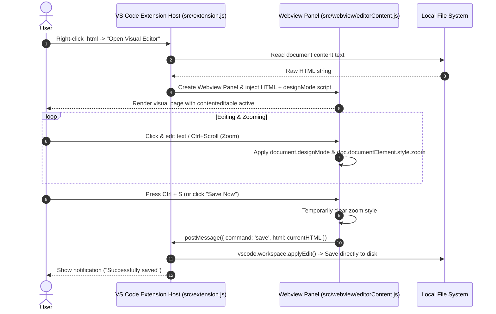

# Architecture & System Design — Visual HTML Editor

This document outlines the architecture, data flow, component breakdown, and extension integration patterns for the **Visual HTML Editor** VS Code extension.

---

## 1. System Overview & Data Flow



---

## 2. Directory Structure

```text
vscode-visual-html-editor/
├── AGENTS.md                  <-- AI & contributor workflow rules
├── ARCHITECTURE.md            <-- Architectural specification (this file)
├── LICENSE                    <-- MIT License
├── README.md                  <-- Public usage documentation
├── package.json               <-- Extension manifest & npm scripts
├── .gitignore                 <-- Git exclusions
├── .vscodeignore              <-- VSIX packaging exclusions
├── src/
│   ├── extension.js           <-- VS Code extension entry point & message bridge
│   ├── utils/
│   │   └── zoomUtils.js       <-- Pure utility logic for zoom bounds & math
│   └── webview/
│       └── editorContent.js   <-- Webview HTML, Toolbar, & iframe generator
└── test/
    ├── editorContent.test.js  <-- Integration tests for webview content
    └── zoomUtils.test.js      <-- Unit tests for zoom calculations
```

---

## 3. Core Components

### 3.1 Extension Host (`src/extension.js`)
- **Responsibilities**:
  - Registers the VS Code command `visual-html-editor.open`.
  - Determines active document URI from context menu or active editor.
  - Spawns and manages the `vscode.WebviewPanel`.
  - Listens for IPC messages (`onDidReceiveMessage`) from the Webview.
  - Interacts with VS Code workspace API (`vscode.WorkspaceEdit`) to persist file changes safely to disk.

### 3.2 Webview Content Generator (`src/webview/editorContent.js`)
- **Responsibilities**:
  - Generates the isolated webview DOM structure containing:
    1. **Top Toolbar**: Controls for zoom (`-`, `100%`, `+`), hints, and save button.
    2. **Editing Canvas**: An `<iframe>` loading the target HTML content.
  - Injects `document.designMode = 'on'` inside the iframe context.
  - Captures `Ctrl + S` and `Ctrl + Wheel` events across both window and iframe scopes.
  - Communicates back to Extension Host via `acquireVsCodeApi().postMessage()`.

### 3.3 Zoom Utility Module (`src/utils/zoomUtils.js`)
- **Responsibilities**:
  - Pure functions for clamping zoom levels (`0.3x` to `3.0x`).
  - Formatting zoom percentage display strings.
  - Completely decoupled from VS Code APIs to allow 100% Node.js unit testing.

---

## 4. Key Design Decisions & Trade-offs

1. **Iframe Sandboxing for Visual Editing**:
   - *Decision*: Host the user HTML inside an `<iframe>` within the Webview panel.
   - *Rationale*: Prevents the user's custom CSS styles from leaking into and breaking the extension's UI toolbar.

2. **Clean Save Protocol**:
   - *Decision*: Temporarily strip `style.zoom` before extracting `outerHTML` on save, then restore it.
   - *Rationale*: Ensures preview state (zoom level) is never accidentally written into the user's source code file.

3. **Node.js Native Testing (`node --test`)**:
   - *Decision*: Use Node's built-in test runner instead of heavy test frameworks.
   - *Rationale*: Zero-dependency, ultra-fast test execution (`<50ms`).
